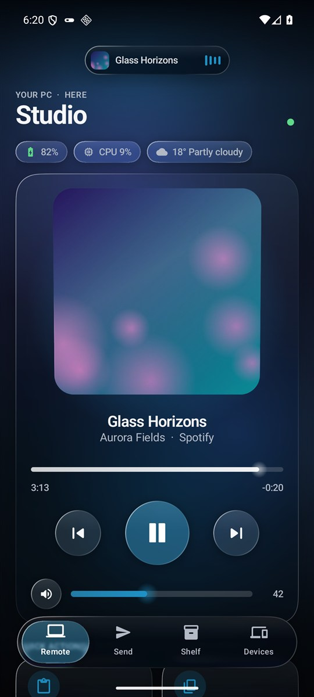
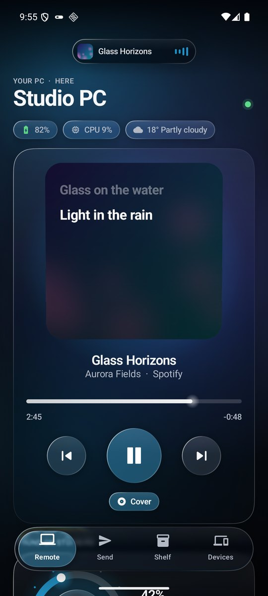
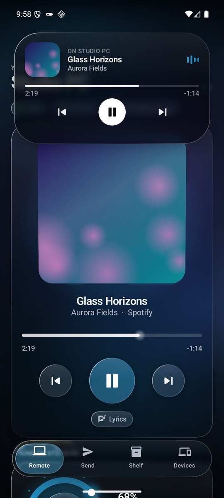
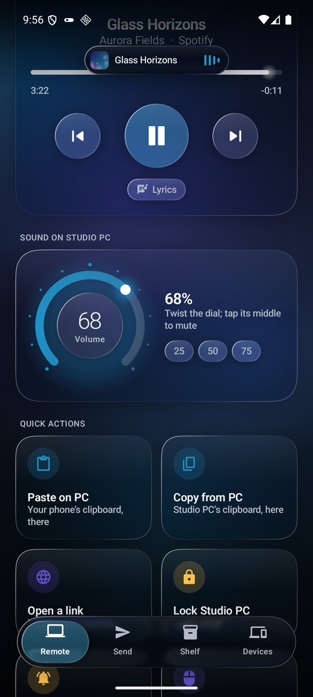
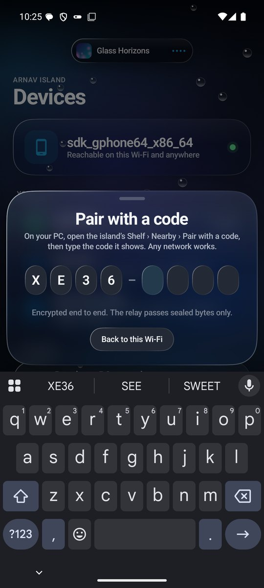
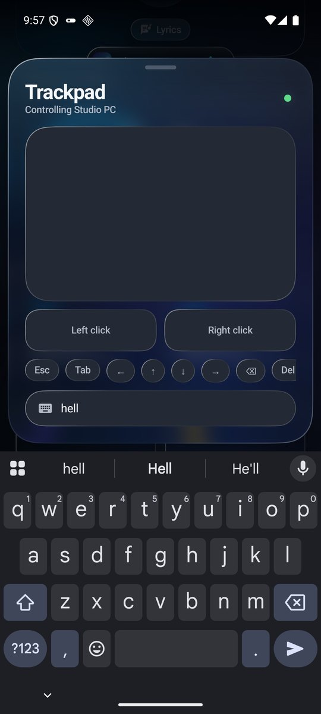
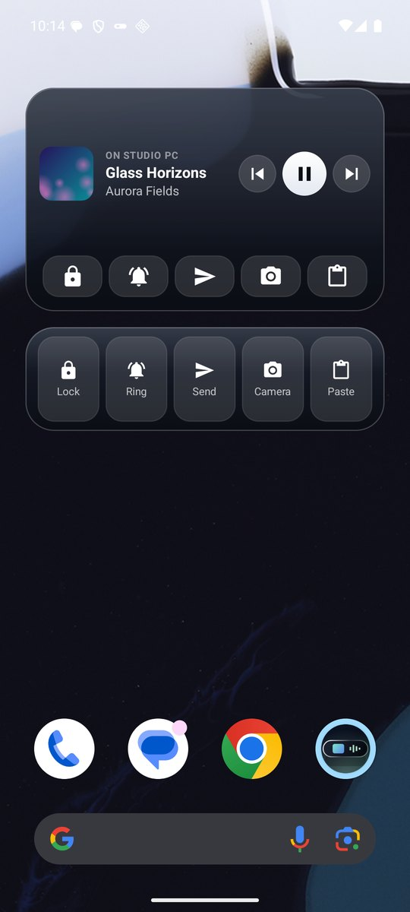
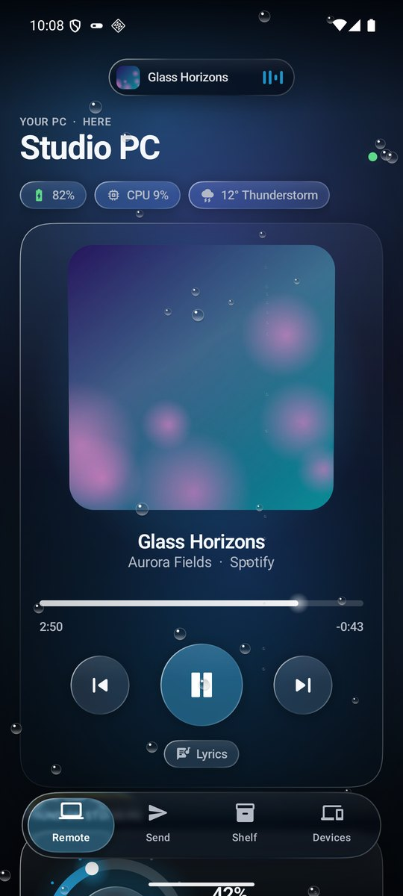

# Arnav Island for Android

Your [Arnav Island](https://github.com/Arnav-Dugad/arnav-island), in your hand. It's a liquid-glass companion for the Windows island. It works on the same Wi-Fi, and from anywhere else too. You can:
- control what plays on your PC, with its lyrics
- move files and photos both ways
- use the phone as the PC's trackpad and keyboard
- see and answer your phone's notifications and calls on the island

**[Download the latest APK](https://github.com/Arnav-Dugad/arnav-island-android/releases/latest)** · Android 9 or later · free, open source, no account

<p>




</p>
<p>




</p>

## What it does

**Anywhere**
- On the same Wi-Fi, devices talk directly. On different networks (another Wi-Fi, mobile data) they reach each other through a free public relay, end-to-end encrypted. It works on its own once you have paired.
- To pair from anywhere, the island shows a code (**Shelf › Nearby › Pair with a code**). Type it on the phone, then check both show the same six digits.

**The remote**
- See what plays on your PC: its cover, title, artist and app.
- Scrub through the song (with a soft click at each lyric line), play and pause, skip.
- Tap the cover and it turns over to the song's lyrics. The sung line is lit word by word, and tapping a line plays from there.
- The PC's volume on a dial: twist it, with a click every 5%, and tap its middle to mute.
- Quick actions:
  - paste your phone's clipboard on the PC
  - copy the PC's clipboard to your phone
  - open a link in the PC's browser
  - lock the PC
  - **Find my PC**: the island chimes and lights up
  - **Trackpad**, below
- The PC's battery, how busy it is, and the weather where it is.

**Trackpad and keyboard**
- One finger moves the pointer, a tap clicks, and two fingers scroll. A two-finger tap right-clicks, and a double tap held down drags.
- Typing goes straight to the PC, with the keys a phone lacks: Esc, Tab, the arrows, Delete, Start, switch app, copy, paste, undo, show the desktop.

**Files and photos, both ways**
- Send photos, videos and files at full quality, any size, from the app or any app's **Share › Send to PC**.
- **Camera to Shelf:** take a photo and it lands on the island's Shelf a moment later. The island can also ask for one.
- Files from your PC arrive in **Downloads › Arnav Island**, after you accept them (or automatically, if you choose).
- Take anything from the PC's **Shelf** with a tap.

**On your PC's island**
- Your phone's notifications, with each app's icon. **Reply** from the PC's keyboard, or mark as read. The card goes when the notification does.
- **Calls:** see who's calling, and decline from the PC.
- **Your phone's details:** battery, charging, temperature, storage, memory, network, sound mode, Android version, uptime, and what plays on the phone.
- **Universal clipboard:** copy on one, paste on the other (with the island's *Universal clipboard* on).
- **Find my phone:** the island rings this phone loudly, even on silent. The ring screen pulses with the vibration and warms as you pick the phone up.

**On this phone**
- **Your PC's music player** on the lock screen and in quick settings, with the cover, the controls and a seek bar.
- **Widgets:** the PC's music with its controls, and quick actions (lock, ring, send, camera, paste).
- **Shortcuts** (touch and hold the app icon): Photo to Shelf, Trackpad, Find my PC, Paste on PC.
- **Music handoff:** a song continues here from where the PC was, and one tap sends it back.

**Liquid glass**
- Surfaces bend what is behind them at their edges, blur and saturate it, and catch a rim of light that moves as you tilt the phone. Refraction needs Android 13 or later; blur needs Android 12 or later.
- The island at the top melts open into the song's card, widens for transfers, and drops open to say what happened. Files in flight stream through it as light.
- Rain, snow or fog on the glass when that's the weather where your PC is.
- Light on the battery:
  - The rim of light is drawn on its own, so tilting the phone never redraws the refraction.
  - The light behind the glass stands still while the app is hidden, a sheet covers it, or the battery saver is on.
- Prefer it plain? **Devices › Appearance › Liquid glass** turns it into solid surfaces.
- Android's *Remove animations* is respected.

**Updates itself**
- The app checks this repository's releases twice a day.
- With *Update automatically* on, a new version is:
  1. downloaded
  2. checked against its published SHA-256 and against the app's own signing certificate
  3. installed

  On Android 12 or later, once the app has installed its first update, later ones install without asking.
- **Devices › Release history** lists every version and what it brought.

## Getting started

1. On your PC, install [Arnav Island](https://github.com/Arnav-Dugad/arnav-island/releases/latest) 0.20 or later. Turn on **Settings › Privacy & productivity › Share with my PCs**. Version 0.19 works too, without the features marked 0.20 in its notes.
2. On your phone, download the APK from [Releases](https://github.com/Arnav-Dugad/arnav-island-android/releases/latest) and open it. Android asks once to allow installs from your browser.
3. Open the app and tap **Pair with your PC**:
   - **On the same Wi-Fi:** tap your PC on the radar.
   - **Anywhere:** on the PC, open the island's **Shelf › Nearby › Pair with a code**, then type the code on the phone.

   Check that both show the same six digits, then confirm on both.

To see your notifications and calls on the island, turn on **Devices › Your notifications**. Android asks you to allow notification access. For the phone to stay reachable everywhere, tap **Devices › Always reachable › Allow**.

## Privacy and security

- **On the same Wi-Fi**, everything goes directly between your devices.
- **On different networks**, it passes through a free public MQTT broker over TLS (broker.hivemq.com, broker.emqx.io or test.mosquitto.org). Everything is sealed end to end before it leaves your device. The broker sees only random-looking topic names and encrypted bytes. It can't read or change what they carry. Turn this off with **Devices › Reach my PCs anywhere**.
- There are no accounts, analytics or ads, and nothing is stored in a cloud.
- Devices pair once with a code.
- Every connection is end-to-end encrypted:
  - keys: ECDH P-256, checked against the pairing
  - encryption: AES-256-GCM, with fresh keys for each connection
- This phone's key is sealed by the Android Keystore and is never backed up.
- Otherwise the app goes online only to look for its own updates here.
- Your PC shows your notifications only while its *My phone's notifications* setting is on. It keeps them in memory only.
- Notifications you hide on the lock screen are never sent. Replies and actions run on the phone; only the words you typed travel.
- Copies marked sensitive (passwords) are never sent by the universal clipboard.

## Checking a download

Each release has `ArnavIsland-<version>.apk.sha256` next to the APK. Releases are signed with this certificate:

```
CN=Arnav Island for Android, O=Arnav Dugad
SHA-256 0b:67:2d:71:5c:f1:2b:52:de:d4:d9:46:76:46:d5:58:54:90:04:81:3f:7e:d3:13:db:f7:1f:76:3b:5a:a1:ca
```

`apksigner verify --print-certs ArnavIsland-<version>.apk` shows it. The app installs an update only if it has this certificate.

## Building

Needs Android Studio's JDK (21) and the Android SDK (platform 36).

```powershell
.\gradlew.bat :app:testDebugUnitTest :app:assembleDebug
```

The protocol engine (`app/src/main/java/.../link`) is plain Kotlin, and its tests run on the JVM. `InteropTest` runs the phone against the real Windows sharing engine:
- Set `ARNAV_SHARE_PEER` to the island's `build\share_peer.exe`.
- Also set `ARNAV_RELAY_TEST` to run the same checks over the internet relay.

[docs/RELEASING.md](docs/RELEASING.md) describes releases.

## License

MIT. See [LICENSE](LICENSE).
