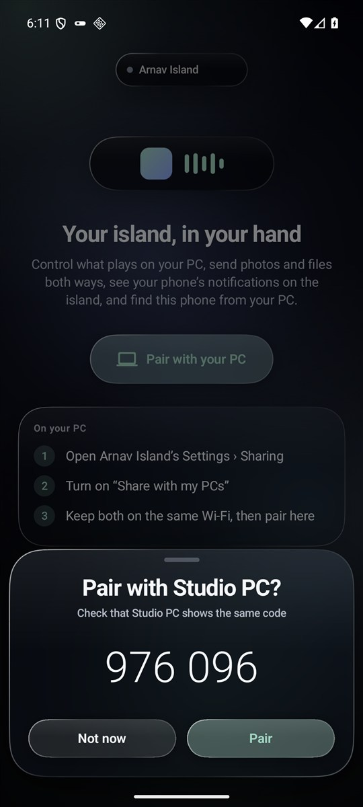
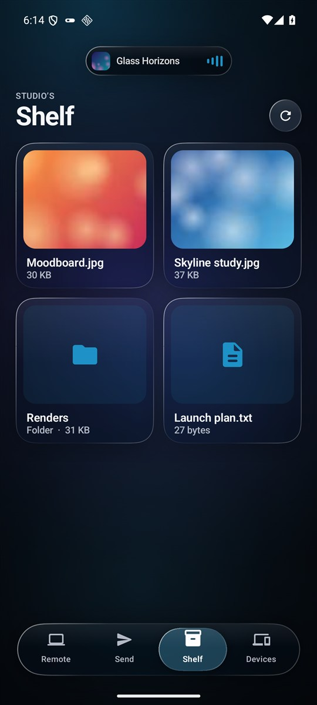
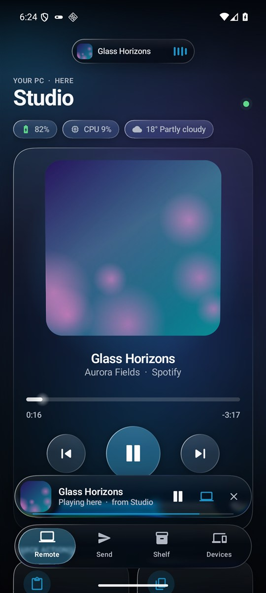

# Arnav Island for Android

Your [Arnav Island](https://github.com/Arnav-Dugad/arnav-island), in your hand. It's a liquid-glass companion for the Windows island. You can control what plays on your PC, move files both ways, and see your phone's notifications on the island. Your PC can also find this phone.

**[Download the latest APK](https://github.com/Arnav-Dugad/arnav-island-android/releases/latest)** · Android 9 or later · free, open source, no account

<p>




</p>

## What it does

**The remote**
- See what plays on your PC: its cover, title, artist and app.
- Scrub through the song, play and pause, skip, and change or mute the PC's volume.
- The app lights itself in the song's own colours, as the island does.
- Quick actions:
  - paste your phone's clipboard on the PC
  - copy the PC's clipboard to your phone
  - open a link in the PC's browser
  - lock the PC
- The PC's battery, how busy it is, and the weather where it is.

**Files, both ways**
- Send photos, videos and files at full quality, any size, from the app or any app's **Share › Send to PC**.
- Files from your PC arrive in **Downloads › Arnav Island**, after you accept them (or automatically, if you choose).
- Take anything from the PC's **Shelf** with a tap.

**Music handoff**
- When your PC continues a song on this phone, it plays from where the PC was.
- If the PC plays it from a file, the file comes over; if it plays in an app like Spotify, the song opens in your phone's app instead.
- One tap sends it back to the PC, from where it has got to.

**On your PC's island**
- Your phone's notifications show on the island, with each app's own icon.
- Your phone's battery shows on its Nearby row, and the island says when it runs low.
- **Find my phone:** the island's Nearby row has a **Ring** button. It rings this phone loudly, even on silent, until you tap *Found it*.

**Liquid glass**
- Surfaces bend what is behind them at their edges, blur and saturate it, and catch a rim of light that moves as you tilt the phone. Refraction needs Android 13 or later; blur needs Android 12 or later.
- A glass tab bar with a drop that follows your swipes.
- A little island at the top, which widens for transfers and drops open to tell you what happened.
- Springs everywhere. Android's *Remove animations* is respected.

**Updates itself**
- The app checks this repository's releases twice a day.
- With *Update automatically* on, a new version is:
  1. downloaded
  2. checked against its published SHA-256 and against the app's own signing certificate
  3. installed

  On Android 12 or later, once the app has installed its first update, later ones install without asking.
- **Devices › Release history** lists every version and what it brought.

## Getting started

1. On your PC, install [Arnav Island](https://github.com/Arnav-Dugad/arnav-island/releases/latest) 0.19 or later. Turn on **Settings › Sharing › Share with my PCs**.
2. On your phone, download the APK from [Releases](https://github.com/Arnav-Dugad/arnav-island-android/releases/latest) and open it. Android asks once to allow installs from your browser.
3. Keep both on the same Wi-Fi, open the app and tap **Pair with your PC**. Check that both show the same six digits, then confirm on both.

To see your notifications on the island, turn on **Devices › Your notifications**. Android asks you to allow notification access.

## Privacy and security

- Everything goes directly between your own devices over your Wi-Fi. There are no servers, accounts, analytics or ads.
- Devices pair once with a six-digit code.
- Every connection is end-to-end encrypted:
  - keys: ECDH P-256, checked against the pairing
  - encryption: AES-256-GCM, with fresh keys for each connection
- This phone's key is sealed by the Android Keystore and is never backed up.
- The app goes online only to look for its own updates here.
- Your PC shows your notifications only while its *My phone's notifications* setting is on. It keeps them in memory only.
- Notifications you hide on the lock screen are never sent.

## Checking a download

Each release has `ArnavIsland-<version>.apk.sha256` next to the APK. Releases are signed with this certificate:

```
CN=Arnav Island for Android, O=Arnav Dugad
SHA-256 0b:67:2d:71:5c:f1:2b:52:de:d4:d9:46:76:46:d5:58:54:90:04:81:3f:7e:d3:13:db:f7:1f:76:3b:5a:a1:ca
```

`apksigner verify --print-certs ArnavIsland-<version>.apk` shows it. The app installs an update only if it has this certificate.

## Building

Needs Android Studio's JDK (21) and the Android SDK (platform 36).

```powershell
.\gradlew.bat :app:testDebugUnitTest :app:assembleDebug
```

The protocol engine (`app/src/main/java/.../link`) is plain Kotlin, and its tests run on the JVM. `InteropTest` runs the phone against the real Windows sharing engine: set `ARNAV_SHARE_PEER` to the island's `build\share_peer.exe`. [docs/RELEASING.md](docs/RELEASING.md) describes releases.

## License

MIT. See [LICENSE](LICENSE).
